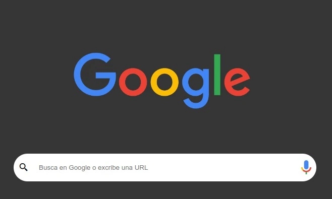

# Google Clone

    

 

## Decripcion

Aplicacion que clona la pagina principal del motor de busqueda de Google.

## Funciones o datos del proyecto

- Al ingresar una busqueda te redirecciona al verdadero motor de busqueda de Google, y realiza la busqueda ingresada.
- Cuenta con opcion para personalizar el fondo.

## Link

- https://teal-genie-3c079b.netlify.app/

## Lenguajes o Herramientas

- HTML
- CSS
- JS

## Autor

** Diego Nieves **

- [LinkedIn](https://www.linkedin.com/in/diego-nieves-04b409242/)
- [Portafolio web](https://nvs-portfolio.netlify.app)

## Contactame

Si quieres contactarme puedes escribirme a nieves.diego0426@gmail.com 👍.
